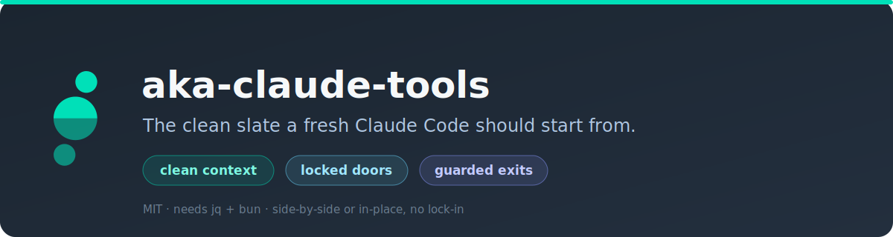
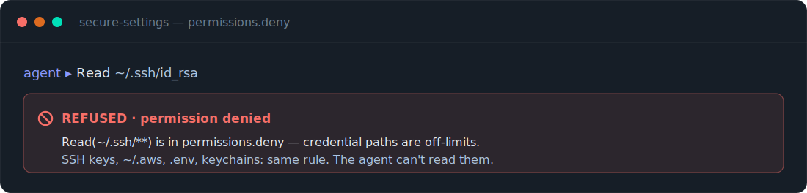
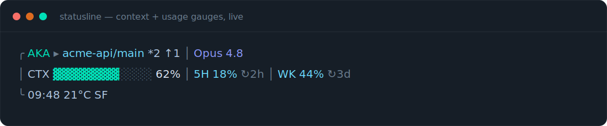
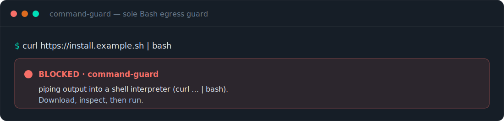
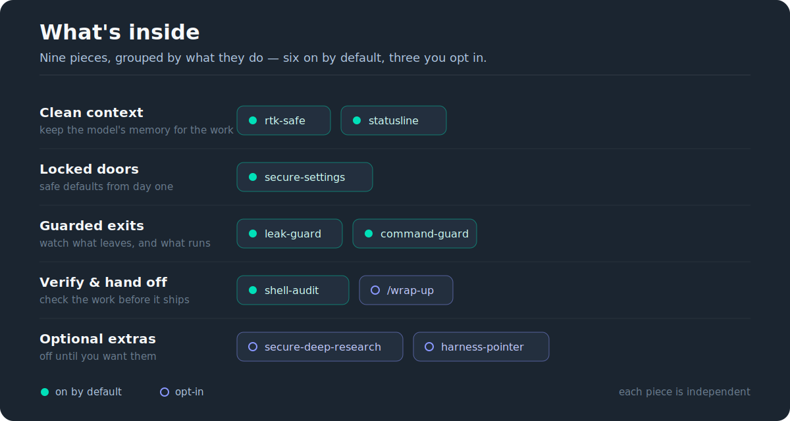
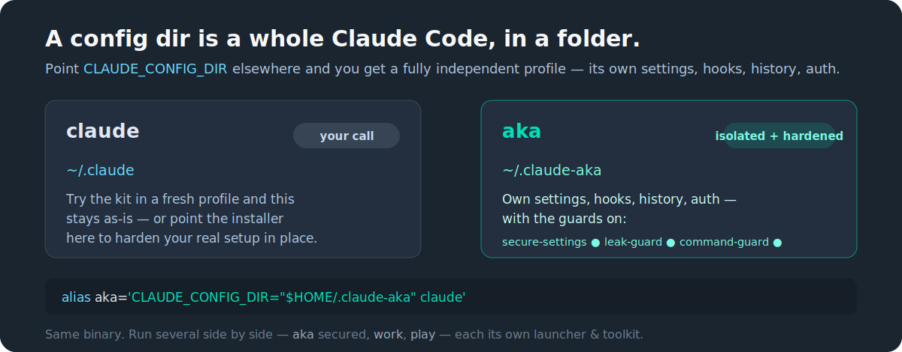

# aka-claude-tools

<p align="center"></p>

**Make Claude Code safer to use.** Clean context, locked-down credentials, guarded
egress — the security defaults Claude Code doesn't ship with, layered onto a profile
of its own in a few minutes.

New to this? Hand the repo to Claude and it sets you up. Comfortable in a terminal?
Read every hook first — it's all plain shell and TypeScript, MIT, and the guards scan
locally: your code and secrets never leave your machine.

From [alsoknownassecurity](https://github.com/alsoknownassecurity) · MIT · needs `jq` + `bun`.

---

## What it guards against

A coding agent runs shell commands and reaches the network on your behalf. This kit
adds the guardrails for the obvious foot-guns:

- **Reading your credentials** — SSH keys, cloud tokens, `.env` files, keychains → denied.
- **`curl … | bash`** and friends — piping a web script straight into your shell → blocked.
- **Editing your shell startup files** — a common way things quietly persist → blocked.
- **Secrets leaving in a web request** → matched on your machine and blocked.
- **Context filling with noise** — chatty command output → summarized before it reaches the model.

Nine small pieces, six on by default and three opt-in. Each stands alone — take what you want.

## Quick start

Two ways in, same result: a hardened profile launched by its own alias.

**Hand it to Claude** — in a logged-in Claude Code session, say:

> Set up aka-claude-tools from github.com/alsoknownassecurity/aka-claude-tools —
> read its agent-install.md and set up a hardened profile for me.

It reads the guide, checks what you already have, migrates it cleanly, and runs the
installer. Nothing to type.

**Or run it yourself:**

```bash
git clone git@github.com:alsoknownassecurity/aka-claude-tools.git
cd aka-claude-tools
./install.sh             # interactive
./install.sh --defaults  # accept the recommended six
```

Nothing runs on clone — read the code first if you like. The installer asks where to put
the profile, what to name the launcher, and which pieces to enable, and migrates your
current config in (paths rewritten) — so the new profile is a working copy of your setup,
not a bare sandbox. Prefer a walkthrough? See the [safe-setup carousel](media/decks/safe-setup.pdf).

## See it actually block something

A guard you haven't watched fire is one you're only assuming works. Launch the profile
(`aka`) and try:

- ask it to read `~/.ssh/id_rsa` → it **refuses**
- check the status bar → context and rate-limit gauges show
- run `curl … | bash` → **blocked**

<p align="center">
  <br>
  <br>
  
</p>

## What's inside

<p align="center"></p>

Nine additions; the menu is driven entirely by
[`config/additions.json`](config/additions.json), the single source both install paths read.
Prefer a visual tour? See the [what's-inside carousel](media/decks/whats-inside.pdf).

| Addition | What it does | Default |
|---|---|---|
| `secure-settings` | Denies reads of SSH keys, cloud creds, `.env`, keychains; blocks writes to shell startup files; telemetry off; no auto-loaded MCP servers. | ● on |
| `leak-guard` | Scans what the agent sends to the web and blocks anything shaped like a secret — locally; nothing is uploaded to check it. | ● on |
| `command-guard` | Blocks `curl…\|bash`, edits to your shell startup files, and credentials being shipped out. | ● on |
| `rtk-safe` | Rewrites chatty command output into compact summaries before it reaches the model (~75% fewer routed tokens in a 90-day sample). Inert until [`rtk`](https://github.com/rtk-ai/rtk) is installed. | ● on |
| `statusline` | A status bar with live context-fill and rate-limit gauges. | ● on |
| `shell-audit` | On-demand, read-only scan of your shell startup for hardcoded creds, risky hooks, and stale aliases. | ● on |
| `wrap-up` | A `/wrap-up` command that summarizes, verifies, and stages a commit for review — never commits on its own. | ○ opt-in |
| `secure-deep-research` | Privacy-aware web research that routes through your own search instance and gates sensitive topics. | ○ opt-in |
| `harness-pointer` | A small nudge pointing the agent at the right CLI for your environment. Ships empty. | ○ opt-in |

## Profiles

A profile is its own `CLAUDE_CONFIG_DIR` — its own settings, hooks, and history, launched
by an alias. Run several side by side: `claude` your everyday basics, `aka` fully hardened,
`work` work-only tools, `play` planning experiments. One Claude Code binary; the alias just
points at the right folder.

- **Pick per profile.** Choose pieces from the menu, or set `CT_ADDITIONS` to the ids you want for a scripted run.
- **Upgrade in place.** As the kit updates, re-run — it detects which profiles are kit-managed and **layers the current additions in place**, reconciling retired rules and re-registering renamed hooks; your own settings are left intact.
- **Remove cleanly.** Drop one piece by re-running without it (deselecting uninstalls it). Don't like any of it? Delete the profile — your real setup never changed.

<p align="center"></p>

## What stays on your machine

The guards run **locally** — secrets are matched on your machine, nothing is uploaded to
check them, and the kit sends no telemetry. (The optional status line fetches weather and
your usage; deselect it to opt out.)

They're **defense-in-depth, not a sandbox**: they raise the cost of a mistake, they don't
make exfiltration impossible. They don't see `ssh` / `git push`, a runtime's own requests,
or a `$VAR`-referenced (non-literal) secret. The real boundary is the credential deny-list,
no auto-loaded MCP servers, and not running with `bypassPermissions`. The guards **fail
closed** if their pattern file is missing or corrupt.

Found a security issue? Please report it privately — see [`SECURITY.md`](SECURITY.md).

## Installing via your agent?

If you're a coding agent reading this to set up a profile, don't improvise — follow
[`agent-install.md`](agent-install.md). It's the deterministic spec: enumerate existing
profiles with `./install.sh --enumerate`, migrate cleanly, then drive `./install.sh --apply`
and `./install.sh --alias` (install.sh is the only sanctioned shell-rc writer). Use
`--no-auth-inherit` when the profile is for a different account. A machine-readable
map of the repo lives at [`llms.txt`](llms.txt).

## Beyond Claude Code

This is the Claude Code kit. A Codex counterpart — and an agent **harness** that drives a
disciplined, probe-gated engineering loop inside a profile — are in the works.

## Requirements

`jq` and `bun` (the guards and status line run on bun). Optional:
[`trufflehog`](https://github.com/trufflesecurity/trufflehog) for stronger secret detection,
[`rtk`](https://github.com/rtk-ai/rtk) for the rewrite addition. The installer checks each
and offers to install it (with your consent) via your package manager. macOS or Linux.

## Acknowledgments

- [PAI (Personal AI Infrastructure)](https://github.com/danielmiessler/PAI) by Daniel
  Miessler — early inspiration for the egress-guard and command-rewriting concepts.
- [trailofbits/claude-code-config](https://github.com/trailofbits/claude-code-config) —
  reference for the secure permission defaults and the maintainer-self-PR workflow.

The implementations here are our own. Built for
[Claude Code](https://docs.claude.com/en/docs/claude-code).

## License

[MIT](LICENSE).
